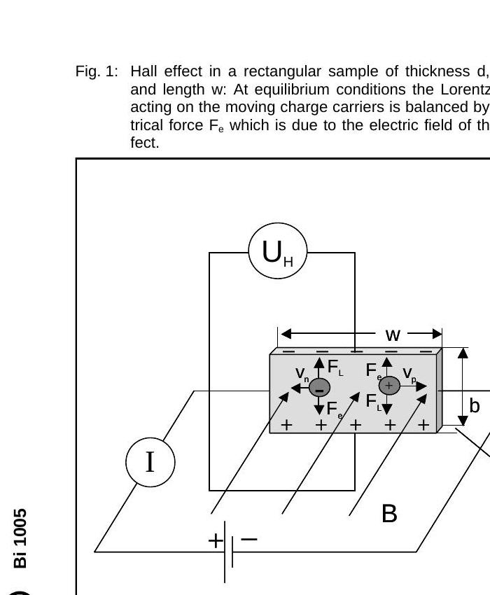
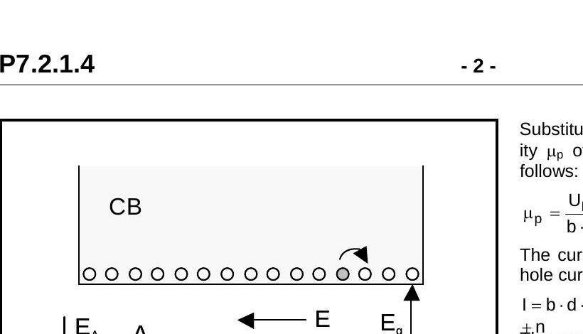
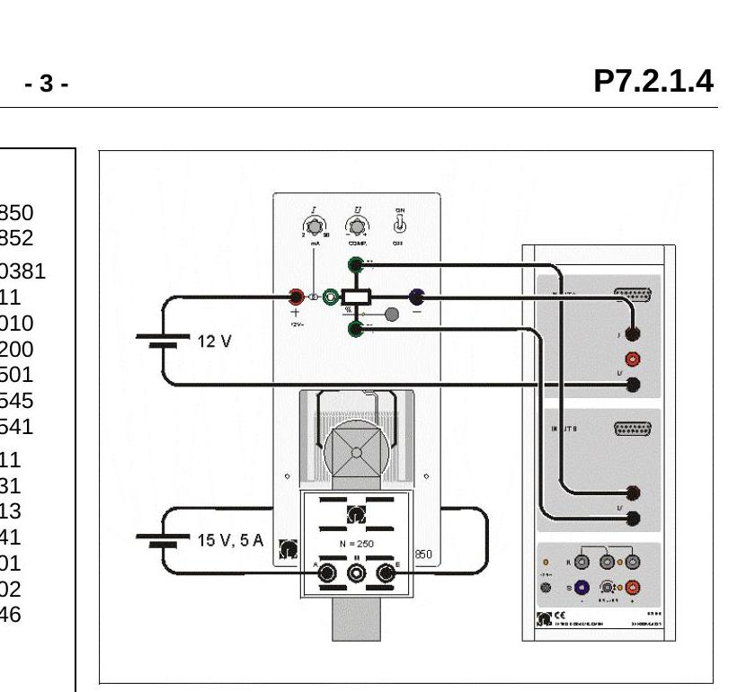
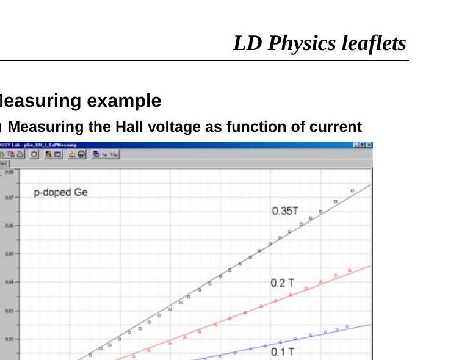
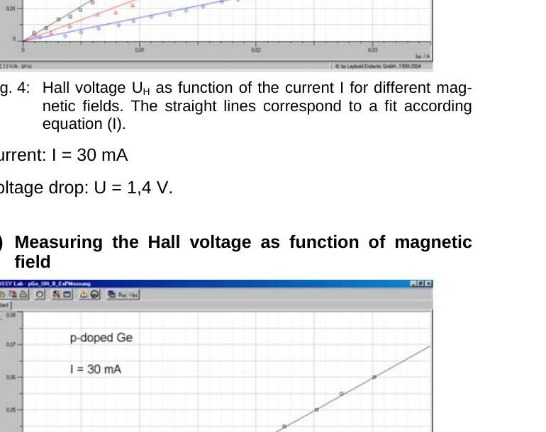
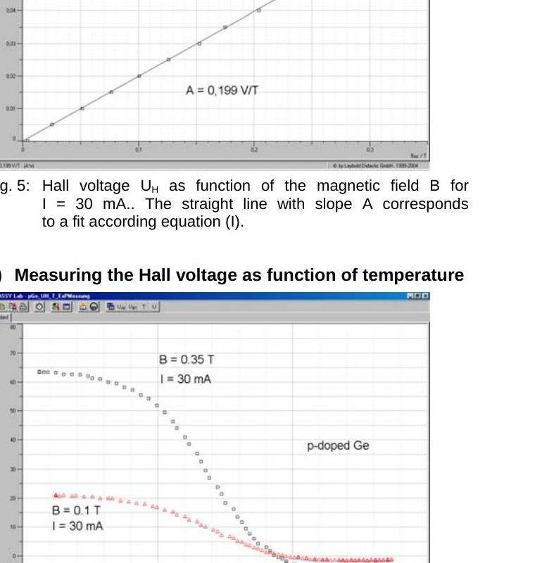
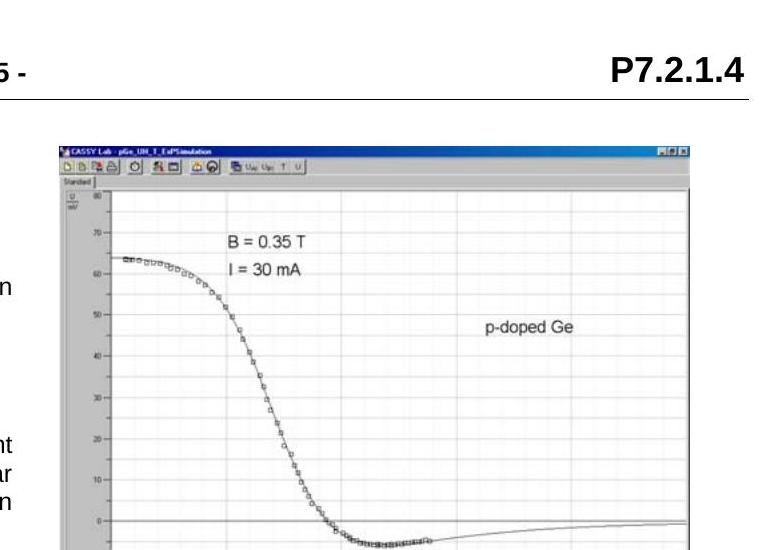
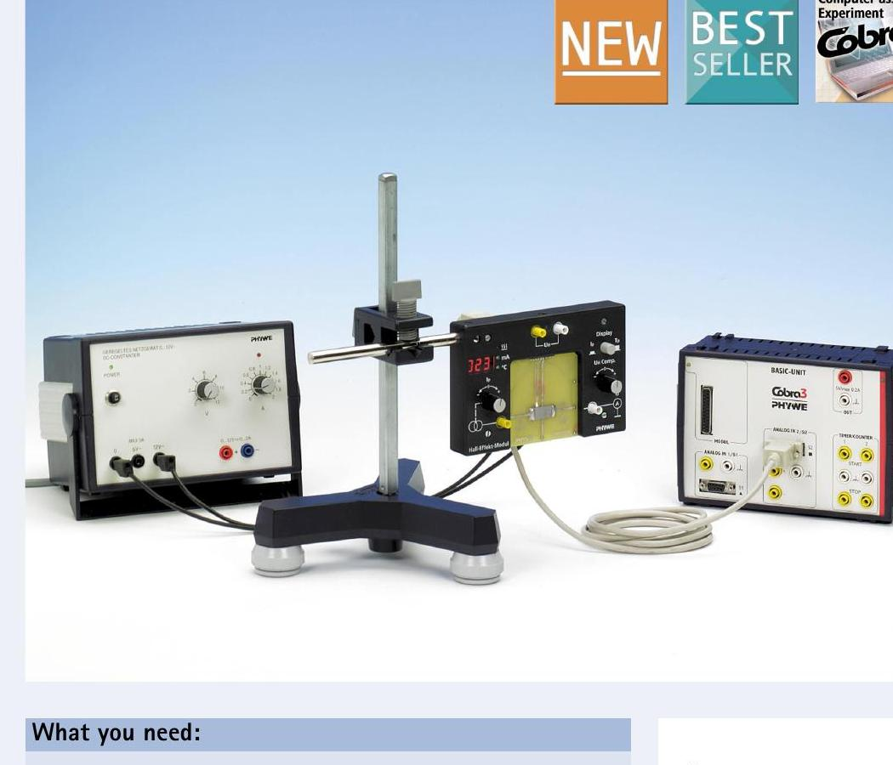
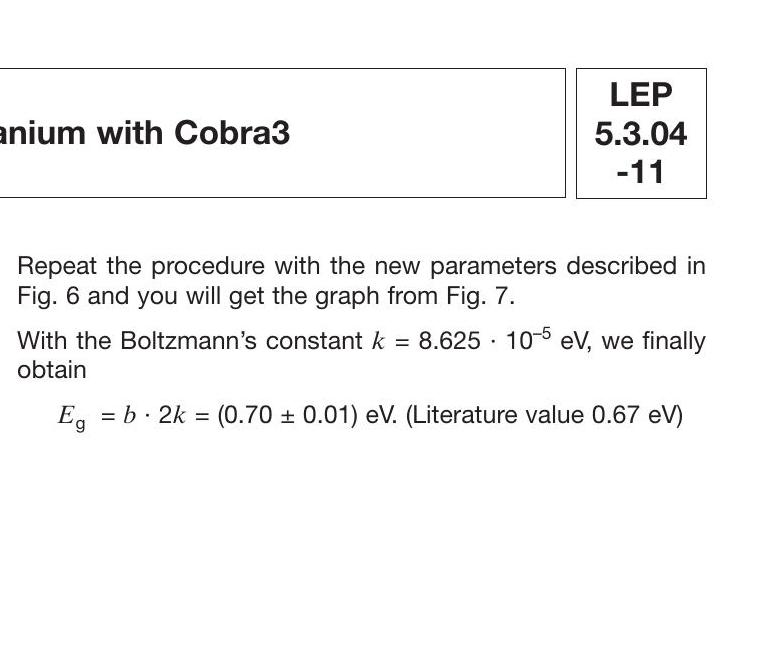

# Hall Effect in p-Ge & Band Gap of Germanium

## 실험 매뉴얼 (번역 및 보충)

---

## 1. 실험 목적

p-도핑된 게르마늄(p-Ge)에서 **홀 효과(Hall Effect)**를 관찰하고, 이를 통해 반도체의 미시적 물리량인 **전하 운반자의 밀도(carrier concentration)**와 **이동도(mobility)**를 측정한다.

구체적인 실험 목표는 다음과 같다:

- **일정한 자기장에서** 홀 전압을 전류의 함수로 측정하여 전하 운반자의 밀도와 이동도를 결정한다.
- **일정한 전류에서** 홀 전압을 자기장의 함수로 측정하여 홀 계수를 결정한다.
- *(선택)* 홀 전압을 온도의 함수로 측정하여 외인성(extrinsic) 전도에서 진성(intrinsic) 전도로의 전이를 관찰한다.

---

## 2. 이론적 배경

### 2.1 홀 효과란?

홀 효과는 전류가 흐르는 도체 또는 반도체에 수직 방향으로 자기장을 가했을 때, 전류와 자기장 모두에 수직인 방향으로 전위차(홀 전압, U_H)가 발생하는 현상이다. 이 효과는 1879년 에드윈 홀(Edwin Hall)에 의해 발견되었으며, 반도체 물리학에서 전하 운반자의 종류(전자 또는 정공), 밀도, 이동도를 결정하는 데 매우 중요한 실험 방법이다.

**Fig. 1:** 두께 d, 높이 b, 길이 w인 직사각형 시료에서의 홀 효과. 평형 상태에서 움직이는 전하 운반자에 작용하는 로렌츠 힘 F_L은 홀 효과에 의한 전기장으로부터의 전기력 F_e와 균형을 이룬다.

### 2.2 홀 효과의 물리적 원리

두께 d인 직사각형 p-도핑 게르마늄 시료를 균일한 자기장 B 속에 놓자. 시료에 전류 I가 흐르면, 자기장 B와 전류 I 모두에 수직인 방향으로 홀 전압 U_H가 발생한다:

$$
U_H = R_H \cdot \frac{I \cdot B}{d} \quad \text{...(I)}
$$

여기서 R_H는 **홀 계수(Hall coefficient)**로, 물질의 종류와 온도에 의존한다.

#### 로렌츠 힘과 홀 전압의 발생 메커니즘

전류가 흐르는 도체에 자기장을 수직으로 인가하면, 전하 운반자는 **로렌츠 힘(Lorentz force)**을 받는다:

$$
\vec{F}_L = q(\vec{v} \times \vec{B})
$$

여기서 q는 전하량, v는 표류 속도(drift velocity), B는 자기장이다.

이 힘에 의해 전하 운반자가 시료의 한쪽 면으로 축적되면, 시료 양쪽 면에 전위차가 형성된다. 이 전위차에 의한 전기력이 로렌츠 힘과 평형을 이루면 정상 상태에 도달하며, 이때의 전위차가 바로 홀 전압이다:

$$
e_0 \cdot v_d \cdot B = e_0 \cdot E_H \quad \text{(평형 조건)} \quad \text{...(VI)}
$$

p형 반도체에서는 정공이 주된 전하 운반자이므로, 정공이 한쪽 면으로 밀려나 양의 전하가 축적되고 반대쪽에는 음의 전하가 남는다. 이 축적 방향으로부터 전하 운반자의 부호(양/음)를 알 수 있다.

### 2.3 홀 계수

약한 자기장에서 홀 계수 R_H는 전하 밀도와 이동도의 함수로 표현할 수 있다:

$$
R_H = \frac{1}{e_0} \cdot \frac{p \cdot \mu_p^2 - n \cdot \mu_n^2}{(p \cdot \mu_p + n \cdot \mu_n)^2} \quad \text{...(II)}
$$

여기서:
- e₀ = 1.602 × 10⁻¹⁹ C (기본 전하량)
- p = p_E + p_S (정공의 총 밀도)
  - p_E: 진성 전도에 의한 정공 밀도
  - p_S: p-도핑에 의한 정공 밀도
- n = n_E: 진성 전도에 의한 전자 밀도
- μ_p: 정공의 이동도
- μ_n: 전자의 이동도

**핵심 포인트:** 홀 계수 R_H의 부호로부터 주된 전하 운반자의 종류를 판별할 수 있다. R_H > 0이면 정공(p형), R_H < 0이면 전자(n형)가 주된 운반자이다.

### 2.4 외인성(Extrinsic) 전도 영역에서의 단순화

실온 부근에서 p-도핑 게르마늄에서는 도핑에 의한 정공 밀도 p_S가 진성 전하 운반자 밀도보다 훨씬 크다 (n = n_E = p_E ≈ 0). 이 경우 홀 전압 측정으로부터 정공 밀도를 직접 구할 수 있다:

$$
p_S = \frac{B}{e_0 \cdot d \cdot A} \quad \text{...(III)}
$$

여기서 A는 U_H vs. I 그래프의 기울기이다 (A = R_H · B / d).

**Fig. 2:** 외인성 전도(왼쪽)와 진성 전도(오른쪽)의 에너지 밴드 다이어그램. III족 원소(B, Al, In, Ga 등)를 도핑하면 가전자대(VB)에 정공이 생성된다. 온도가 높아지면 가전자대의 전자가 에너지 갭 E_g을 넘어 전도대(CB)로 올라가 전자-정공 쌍이 생성된다.

### 2.5 도핑과 에너지 밴드

게르마늄 결정에 III족 원소(붕소 B, 알루미늄 Al, 인듐 In, 갈륨 Ga 등)를 도핑하면 **수용체(acceptor)** 준위가 형성된다. 이 수용체 준위의 활성화 에너지 E_A는 약 0.01 eV로, 밴드 갭 E_g(약 0.67 eV)보다 훨씬 작다. 따라서 실온에서 수용체 준위로부터의 정공이 쉽게 활성화되어 전도에 기여한다.

**반도체의 전도 영역 구분 (온도에 따른 변화):**

1. **저온 영역 (동결 영역, Freeze-out):** 가전자대에서 수용체 준위로의 여기만이 전하 운반자의 유일한 원천이다. 정공 밀도 p_S가 온도와 함께 증가한다.
2. **외인성 전도 영역 (Extrinsic):** 모든 수용체 준위가 점유되어 p_S가 온도에 무관하게 일정해진다. 이 영역에서 진성 전하 운반자는 무시할 수 있다.
3. **진성 전도 영역 (Intrinsic):** 온도가 더 높아지면 가전자대에서 전도대로의 직접적인 열적 여기가 일어난다. 진성 전하 운반자 밀도가 도핑 밀도를 초과하면서 전도가 진성 전도에 지배된다.

### 2.6 이동도(Mobility)

이동도는 전하 운반자와 결정 격자 사이의 상호작용(산란)의 척도이다. p-도핑 게르마늄에서 정공의 이동도 μ_p는 다음과 같이 정의된다:

$$
\mu_p = \frac{v_p}{E} \quad \text{...(IV)}
$$

여기서 v_p는 표류 속도, E는 전기장이다.

전기장은 전압 강하 U와 시료 길이 w로부터:

$$
E = \frac{U}{w} \quad \text{...(V)}
$$

홀 전압으로부터 표류 속도를 구하면:

$$
v_p = \frac{U_H}{b \cdot B} \quad \text{...(VII)}
$$

이를 종합하면 이동도를 다음과 같이 추정할 수 있다:

$$
\mu_p = \frac{U_H \cdot w}{b \cdot B \cdot U} \quad \text{...(VIII)}
$$

여기서 b는 시료의 높이, w는 시료의 길이이다.

---

## 3. 실험 장비

| 장비 | 품번 | 수량 |
|------|------|------|
| Hall effect 기본 유닛 (Ge용) | 586 850 | 1 |
| p-도핑 Ge 플러그인 보드 | 586 852 | 1 |
| Combi B-Sensor S | 524 0381 | 1 |
| 15핀 연장 케이블 | 501 11 | 1 |
| Sensor CASSY | 524 010 | 1 |
| CASSY Lab 소프트웨어 | 524 200 | 1 |
| AC/DC 전원 공급장치 (0~15V, 5A) | 521 501 | 2 |
| DC 전원 공급장치 (0~16V, 0~5A) | 521 545 | 1 |
| DC 전원 공급장치 | 521 541 | 1 |
| U-코어 및 요크 | 562 11 | 1 |
| 천공 극편(pole piece) 쌍 | 560 31 | 1 |
| 250턴 코일 | 562 13 | 2 |
| 지지 막대 (25 cm) | 300 41 | 1 |
| 다목적 클램프 | 301 01 | 1 |
| V자형 스탠드 베이스 (20 cm) | 300 02 | 1 |
| 케이블 쌍 (1m, 적색/청색) | 501 46 | 7 |
| PC (Windows 95/98/NT 이상) | - | 1 |

---

## 4. 주의사항 ⚠️

1. **게르마늄 회로판은 매우 취약하다.** 플러그인 보드를 조심스럽게 다루고, 기계적 충격이나 하중을 가하지 않는다.
2. **최대 전류 제한을 반드시 준수한다:**
   - p-Ge 및 n-Ge 보드: **33 mA** 이상 절대 금지
   - Ge (undoped) 보드: **4 mA** 이상 절대 금지
3. p-도핑 Ge 결정은 높은 비저항 때문에 전류만 흘려도 발열한다. 기본 유닛의 전류 제어 손잡이를 사용 전에 왼쪽 끝까지 돌려 최소로 설정한다.
4. 두 코일의 자기장이 **상쇄되지 않도록** 코일 연결 방향에 유의한다. 100 mT 이상의 자기장이 얻어져야 회로가 올바르게 구성된 것이다.
5. 회로가 뜨거울 수 있으므로 **회로 부분을 손으로 만지지 않는다.**
6. CASSY Lab에서 자기장 및 홀 전압 측정 범위를 적절히 설정한다. 범위가 너무 넓으면 데이터가 디지타이즈되고, 너무 좁으면 원하는 범위를 측정하지 못한다.

---

## 5. 실험 셋업

### 5.1 플러그인 보드 장착 및 연결

1. p-도핑 Ge 결정이 든 플러그인 보드를 Hall effect 기본 유닛의 DIN 소켓에 핀이 구멍에 맞물릴 때까지 삽입한다.
2. DIN 플러그가 있는 플러그인 보드를 기본 유닛에 삽입하고, 막대(rod)가 장착된 기본 유닛을 U-코어의 구멍에 끝까지 밀어넣는다. 플러그인 보드가 U-코어와 평행하게 놓이도록 한다.
3. 천공 극편 쌍과 추가 극편을 주의하여 부착하고, 추가 극편을 플러그인 보드의 스페이서까지 밀어넣는다. 플러그인 보드가 구부러지지 않도록 주의한다.
4. 전류 제한 전원 공급장치의 전류 제한기를 왼쪽 끝까지 돌리고 전원을 연결한다.

**Fig. 3:** 전류의 함수로 홀 전압을 측정하기 위한 실험 셋업 (배선도)

### 5.2 자기장 측정

1. B-프로브를 지지 막대와 V자형 스탠드 베이스에 고정한다.
2. 장치 조정 후, B-프로브를 갭(gap)에 주의하여 삽입한다.
3. B-프로브를 연장 케이블을 사용하여 Sensor CASSY에 연결한다.

> **TIP:** 전자석에 흐르는 전류와 자기장의 **교정 곡선(calibration curve)**을 먼저 만들어두면, 이후 매번 자기장을 측정하지 않아도 전류 값으로부터 자기장을 추정할 수 있다.

### 5.3 홀 전압 보상 (Compensation)

일정한 전류 I에서 측정을 수행하기 전에, B = 0 T에서 홀 전압을 보상해야 한다:

1. 전류 I를 측정하기 위해 케이블을 Sensor CASSY의 **Input A**에 연결한다.
2. 홀 전압 U_H를 측정하기 위해 케이블을 Sensor CASSY의 **Input B**에 연결한다.
3. 교차 전류 I를 최대값으로 설정하고 (p-Ge의 경우 최대 33 mA), 보상(compensation)을 켜고 보상 손잡이를 사용하여 홀 전압 U_H를 0으로 맞춘다.

### 5.4 전압 강하 측정

1. 전압 강하 U를 측정하기 위해 케이블을 Sensor CASSY의 Input B에 연결한다.
2. 전류 I를 측정하기 위해 케이블을 Input A에 연결한다.
3. 전류 I를 최대값으로 설정하고 전압 강하 U를 측정한다.

---

## 6. 실험 수행

### 6.1 실험 (a): 전류에 따른 홀 전압 측정

**목적:** U_H를 I의 함수로 측정하여, 식 (I)의 관계를 확인하고 전하 운반자 밀도와 이동도를 결정한다.

**절차:**
1. 홀 전압을 보상한다 (5.3 참조).
2. 자기장 B를 원하는 값으로 설정하고 자기 플럭스 밀도 B를 측정한다.
3. 전류를 최대값으로 설정하고 전압 강하 U를 측정한다.
4. 홀 전압 U_H (Sensor CASSY Input B)를 전류 I (Input A)의 함수로 측정한다.
5. 케이블 연결 후 파라미터를 설정한다.
6. 수동 측정 모드에서 버튼 또는 F9를 사용하여 측정한다.
7. 측정 결과를 저장한다.

**Fig. 4:** 서로 다른 자기장에서 전류 I에 따른 홀 전압 U_H. 직선들은 식 (I)에 따른 피팅 결과이다.

### 6.2 실험 (b): 자기장에 따른 홀 전압 측정

**목적:** U_H를 B의 함수로 측정하여, 홀 계수 R_H를 결정한다.

**절차:**
1. 홀 전압을 보상한다.
2. 전류 I를 원하는 값으로 설정한다.
3. 홀 전압 U_H (Input B)를 자기장 B (Input A)의 함수로 측정한다.
4. 파라미터를 설정하고 수동 측정 모드에서 측정한다.
5. 측정 결과를 저장한다.

**Fig. 5:** I = 30 mA에서 자기장 B에 따른 홀 전압 U_H. 기울기 A를 가진 직선은 식 (I)에 따른 피팅 결과이다.

### 6.3 실험 (c): 온도에 따른 홀 전압 측정 *(선택 사항)*

> **주의:** 본 실험실에서는 과열로 인한 회로 파손 위험 때문에 온도 의존성 실험은 **생략**한다. 과거 고장난 회로의 대부분이 이 실험으로 인해 손상되었다.

**참고용 결과:**

**Fig. 6:** I = 30 mA, 서로 다른 자기장 B에서 온도 T에 따른 홀 전압 U_H. 온도가 올라감에 따라 외인성 전도에서 진성 전도로 전이되는 과정이 관찰된다.

---

## 7. 데이터 분석 및 결과

### 7.1 전류 의존성으로부터의 분석 (실험 a)

예를 들어 B = 0.35 T, I = 30 mA의 경우, U_H vs. I 그래프(Fig. 4)에서 원점을 지나는 직선의 기울기:

$$
A = \frac{R_H \cdot B}{d} = 2.13 \text{ V/A}
$$

여기서 d = 1 × 10⁻³ m, B = 0.35 T이므로 식 (III)에 의해 정공 밀도:

$$
p_S = \frac{B}{e_0 \cdot d \cdot A} = \frac{0.35}{1.602 \times 10^{-19} \times 10^{-3} \times 2.13} = 1.1 \times 10^{21} \text{ m}^{-3}
$$

실온에서의 실험 결과를 사용하면 (U = 1.4 V, B = 0.35 T, U_H = 72 mV, b = 10 mm, w = 20 mm):

**표류 속도:**

$$
v_p = \frac{U_H}{b \cdot B} = \frac{0.072}{0.01 \times 0.35} = 21 \text{ m/s}
$$

**이동도:**

$$
\mu_p = \frac{U_H \cdot w}{b \cdot B \cdot U} = \frac{0.072 \times 0.02}{0.01 \times 0.35 \times 1.4} = 2940 \text{ cm}^2/\text{(V·s)}
$$

### 7.2 자기장 의존성으로부터의 분석 (실험 b)

원점을 지나는 직선의 선형 회귀로부터 홀 전압은 자기장에 비례함을 확인한다:

$$
U_H \propto B
$$

실험 (a)의 결과 U_H ∝ I와 결합하면:

$$
U_H \propto I \cdot B
$$

이는 이론적으로 유도된 식 (I)을 확인한 것이다.

Fig. 5의 직선 피팅에서 (d = 1 × 10⁻³ m, I = 30 mA, 기울기 A = 0.199 V/T):

$$
R_H = \frac{A \cdot d}{I} = \frac{0.199 \times 10^{-3}}{0.03} = 6.6 \times 10^{-3} \text{ m}^3/\text{(A·s)}
$$

이 값을 금속 도체인 은의 홀 계수(R_H = 8.9 × 10⁻¹¹ m³/(A·s))와 비교하면, 반도체의 홀 계수가 약 **10⁷배** 더 큰 것을 알 수 있다. 이것이 반도체가 자기 측정 프로브 등에 활용되는 이유이다.

### 7.3 온도 의존성 분석 (실험 c) *(참고용)*

**Fig. 7:** B = 0.35 T, I = 30 mA에서의 실험 데이터에 대한 이론적 피팅 결과.

피팅 파라미터:
- A = p_S = 1.17 × 10²¹ m⁻³
- B = N₀ = 1.99 × 10²⁶ m⁻³
- C = E_g = 0.74 eV
- D = μ_n/μ_p = 1.81

**물리적 해석:**
- 실온 근처: 홀 전압은 양의 값을 보이며, 이는 도핑에 의한 정공이 전하 수송을 지배함을 나타낸다.
- 온도 증가: 열적으로 활성화된 전자와 정공이 증가하면서 진성 전도가 증가한다.
- 부호 전환: 전자의 이동도가 정공보다 크기 때문에 (μ_n ≈ 2μ_p), 전자의 수가 정공의 수를 넘어서면 홀 전압의 부호가 바뀐다.
- 고온: 전자와 정공의 밀도가 거의 같아지면서 홀 전압이 0에 접근한다.

---

## 8. 실험 요령

1. **Cassy Lab 사용법을 사전에 숙지한다.** 실험 시작 전에 소프트웨어 사용법을 충분히 익혀두자.
2. **측정 데이터를 직접 분석한다.** 단순히 모니터 화면을 캡처하지 말고, 측정된 데이터 테이블을 메모장이나 엑셀로 복사하여 직접 그래프를 그리고 분석한다.
3. **회로 구성을 이해한다.** wiring diagram에만 의존하지 말고, 무엇을 측정하는지 이해하고 회로를 구성한다.
4. **교정 곡선을 활용한다.** 전자석 전류와 자기장의 calibration curve를 먼저 만들어두면 효율적이다.

---

## 9. 추가 실험

p-Ge 외에 **n-Ge**, **Ge (undoped) 보드**가 함께 있다. 회로를 교체하여 동일한 실험을 수행해보고, 문제가 있을 경우 원인을 찾아보자.

n형 게르마늄에서는 홀 전압의 부호가 반대가 되어야 하며, 도핑되지 않은 게르마늄에서는 진성 전하 운반자만 존재하므로 홀 효과를 관측하기 어려울 수 있다.

---

---

# Part 2: 게르마늄의 밴드 갭(Band Gap) 측정

---

## 1. 실험 목적

게르마늄 시료의 **전도도(conductivity)**를 온도의 함수로 측정하고, 이로부터 게르마늄의 **에너지 갭(band gap, E_g)**을 결정한다.

## 2. 이론적 배경

### 2.1 전도도의 정의

전도도 σ는 비저항 ρ의 역수이며, 시료의 기하학적 치수를 이용하여 다음과 같이 계산한다:

$$
\sigma = \frac{1}{\rho} = \frac{l \cdot I}{A \cdot U} \quad \left[\frac{1}{\Omega \cdot m}\right]
$$

여기서:
- ρ: 비저항 (specific resistivity)
- l: 시료의 길이
- A: 시료의 단면적
- I: 전류
- U: 전압

실험에서 사용하는 Ge 시료의 치수는 20 × 10 × 1 mm³이다.

### 2.2 반도체의 온도 의존성 전도

반도체의 전도도는 온도에 따라 특징적으로 변하며, 세 가지 영역으로 구분할 수 있다:

1. **영역 I — 외인성 전도 (Extrinsic conduction):** 낮은 온도에서는 온도가 상승함에 따라 불순물로부터 전하 운반자가 활성화되어 전도도가 증가한다. 도핑에 의한 전하 운반자가 주를 이룬다.

2. **영역 II — 불순물 고갈 (Impurity depletion):** 중간 온도 영역에서는 더 이상의 온도 상승이 불순물의 추가 활성화를 일으키지 않는다. 모든 도핑 원자가 이온화되어 전하 운반자 밀도가 거의 일정하다. 이 영역에서 전도도는 온도에 약하게 의존한다 (이동도의 변화에 의해).

3. **영역 III — 진성 전도 (Intrinsic conduction):** 높은 온도에서는 열적 여기에 의해 가전자대에서 전도대로 전자가 전이된다. 전하 운반자가 추가로 생성되면서 전도도가 급격히 증가한다.

### 2.3 진성 전도 영역에서의 전도도

진성 전도 영역에서 온도 의존성은 본질적으로 지수 함수로 기술된다:

$$
\sigma = \sigma_0 \cdot \exp\left(-\frac{E_g}{2k_BT}\right)
$$

여기서:
- E_g: 에너지 갭 (밴드 갭)
- k_B: 볼츠만 상수 = 8.625 × 10⁻⁵ eV/K
- T: 절대 온도 (K)

**물리적 의미:** 밴드 갭 E_g은 가전자대 꼭대기와 전도대 바닥 사이의 에너지 차이이다. 열적 여기에 의해 전자가 이 에너지 갭을 넘어야 전도대에 도달할 수 있으므로, 더 높은 온도에서 더 많은 전자가 여기되어 전도도가 지수적으로 증가한다. 지수 함수에서 E_g가 2k_BT로 나뉘는 이유는 전자-정공 쌍이 동시에 생성되기 때문이다 (전도대의 상태 밀도와 가전자대의 상태 밀도가 모두 관여).

### 2.4 밴드 갭 결정 방법

위 식의 양변에 자연로그를 취하면:

$$
\ln \sigma = \ln \sigma_0 - \frac{E_g}{2k_B} \cdot \frac{1}{T}
$$

이는 y = ln σ, x = 1/T로 놓았을 때 **선형 관계** y = a + bx 의 형태이며, 기울기는:

$$
b = -\frac{E_g}{2k_B}
$$

따라서 ln σ를 1/T에 대해 그래프로 그리면 진성 전도 영역에서 직선이 나타나며, 그 기울기로부터 밴드 갭을 구할 수 있다:

$$
E_g = -b \cdot 2k_B = |b| \cdot 2k_B
$$

## 3. 실험 셋업 및 절차

**실험 셋업:** 게르마늄 밴드 갭 측정을 위한 장치 구성

1. 시료가 장착된 보드를 홀 효과 모듈의 가이드 홈에 삽입한다.
2. 모듈 뒷면의 AC 입력을 전원 장치의 12V AC 출력에 직접 연결한다.
3. RS232 포트를 통해 PC와 직접 연결한다.
4. 소프트웨어에서 "Cobra3 hall effect"를 게이지로 선택한다.
5. 전류를 **5 mA**로 설정한다. (전류는 측정 중 거의 일정하게 유지되지만, 온도 변화에 따라 전압이 변한다.)
6. 새 측정을 시작하고 모듈 뒷면의 on/off 손잡이로 가열 코일을 활성화한다.
7. 실온에서 최대 **170°C**까지 온도 변화에 따른 전압 변화를 측정한다.
8. 가열 코일은 170°C에서 자동으로 멈춘다. 가열이 끝나면 측정을 중지한다.

## 4. 데이터 분석

### 4.1 전도도 계산

측정된 전압 U_p와 시료 치수 (l = 20 mm, A = 10 × 1 mm² = 10 mm²)를 이용하여 전도도를 계산한다:

$$
\sigma = \frac{l \cdot I}{A \cdot U_p} = \frac{0.005}{U_p} \quad \text{(I = 5 mA일 때)}
$$

소프트웨어의 "channel modification" 기능에서 `f := 0.005/Up` 으로 설정하여 전도도를 계산한다.

### 4.2 역온도 변환

온도축을 1/T (절대온도의 역수)로 변환한다:

소프트웨어에서 `f := 1000/(Tp + 273.15)` 로 설정한다 (단위: 1/(1000·K)).

### 4.3 선형 회귀와 밴드 갭 결정

**Fig. 8:** 절대온도의 역수에 대한 전도도의 회귀 직선

진성 전도 영역 (고온 영역)에서 ln σ vs. 1/T의 선형 회귀를 수행하면:

$$
\text{기울기} \quad b = (4.05 \pm 0.06) \times 10^3 \text{ K}
$$

볼츠만 상수 k_B = 8.625 × 10⁻⁵ eV/K를 사용하여:

$$
E_g = b \times 2k_B = (4.05 \times 10^3) \times 2 \times (8.625 \times 10^{-5}) = (0.70 \pm 0.01) \text{ eV}
$$

**문헌값: E_g = 0.67 eV** — 실험 결과와 매우 잘 일치한다.

> **참고:** 게르마늄의 밴드 갭 0.67 eV는 실리콘(1.12 eV)보다 작으며, 이 때문에 게르마늄은 실온에서 더 높은 진성 전하 운반자 밀도를 가진다. 이것이 게르마늄이 초기 반도체 소자에 사용되었으나 이후 실리콘으로 대체된 이유 중 하나이다 — 작은 밴드 갭으로 인해 고온에서 누설 전류가 크기 때문이다.

---

## 부록: 보충 설명

### A. 홀 효과의 역사적 의의

홀 효과는 1879년 발견되었지만, 모든 전도체에 존재함에도 불구하고 20세기 후반 반도체 기술이 발전할 때까지 실험실 수준의 호기심에 머물러 있었다. III-V족 화합물 반도체의 개발로 이전 재료보다 수 자릿수 더 큰 홀 전압을 생성할 수 있게 되면서, 자기 측정 프로브 등의 기술적 응용이 가능해졌다.

### B. 단순 모델의 한계

본 실험에서 사용된 단순화된 모델은 양자역학적 보정, 즉 밴드 구조와 유효 질량(effective mass) 등을 무시하고 있다. 특히 유효 상태 밀도 N₀은 식 (XIV)에서 가정한 것처럼 상수가 아니라, 전도대와 가전자대의 유효 상태 밀도의 곱으로 온도에 의존한다:

$$
N_0 = \sqrt{N_C \cdot N_V} \propto T^{3/2}
$$

이러한 온도 의존성을 고려하면 보다 정확한 밴드 갭 값을 얻을 수 있다.

### C. 유용한 물리 상수

| 상수 | 기호 | 값 |
|------|------|-----|
| 기본 전하량 | e₀ | 1.602 × 10⁻¹⁹ C |
| 볼츠만 상수 | k_B | 1.381 × 10⁻²³ J/K = 8.625 × 10⁻⁵ eV/K |
| 게르마늄 밴드 갭 (300K) | E_g | 0.67 eV |
| 실리콘 밴드 갭 (300K) | E_g | 1.12 eV |

---

*본 문서는 LD Didactic GmbH (P7.2.1.4) 및 PHYWE (LEP 5.3.04-11) 실험 매뉴얼을 기반으로 번역 및 보충 설명을 추가하여 작성되었습니다.*
